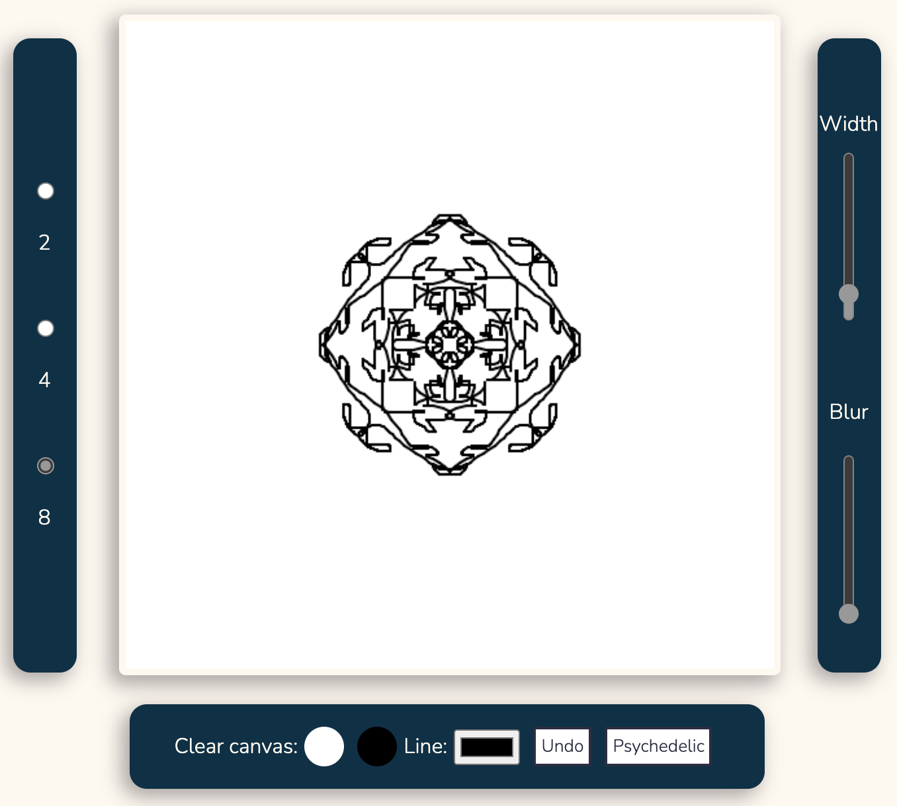

# Symmetry Art

Symmetry Art is an app where users are able to create symmetrical art pieces. This project was inspired by the mandala. It represents the _**spiritual journey**_. We hope users will enjoy drawing unique patterns that inspire. Try it out [here](https://sweetreprise.github.io/mintbean_canvas_app/)!

## Customization features:
- change canvas background
- select number of lines being drawn
- select brush color
- select brush width
- add blur effect
- _psychedelic_ button for randomly generated colorful brush lines
- undo button

## Interface

## User Flow

## Technologies used:
- JavaScript
- HTML
- CSS

## Authors

### **Maria Acuna**

Linkedin: https://www.linkedin.com/in/maria-acuna-ab0b09131/

Contact: maria.pv.acuna@gmail.com

### **Boonyawee Prasertsiripond (Kratai)**

Linkedin: https://www.linkedin.com/in/boonyawee-prasertsiripond/

Contact: krataias65@gmail.com

